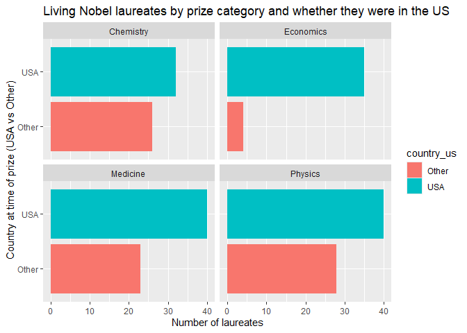

Lab 03 - Nobel laureates
================
Saima Arina
01/31/2026

### Load packages and data

``` r
library(tidyverse) 
```

``` r
nobel <- read_csv("data/nobel.csv")
```

## Exercises

Here is a link to the [lab
instructions](https://datascience4psych.github.io/DataScience4Psych/lab03.html).

### Exercise 1

``` r
nrow(nobel)
```

    ## [1] 935

``` r
ncol(nobel)
```

    ## [1] 26

There are 935 observations and there are 26 variables. Each row
represents a nobel lauterate individual.

### Exercise 2

``` r
nobel_living <- nobel %>% 
  select(firstname, surname, died_date, country, gender, category) %>% 
  filter(is.na(died_date)) %>% 
  filter(!is.na(country))
```

``` r
nobel %>% 
  count(is.na(died_date))
```

    ## # A tibble: 2 × 2
    ##   `is.na(died_date)`     n
    ##   <lgl>              <int>
    ## 1 FALSE                627
    ## 2 TRUE                 308

``` r
nobel %>% 
  count(!is.na(country))
```

    ## # A tibble: 2 × 2
    ##   `!is.na(country)`     n
    ##   <lgl>             <int>
    ## 1 FALSE               254
    ## 2 TRUE                681

``` r
nobel %>% 
  count(gender)
```

    ## # A tibble: 3 × 2
    ##   gender     n
    ##   <chr>  <int>
    ## 1 female    52
    ## 2 male     856
    ## 3 org       27

### Exercise 3

``` r
nobel_living <- nobel %>% 
  select(firstname, surname, died_date, country, gender, category) %>% 
  filter(is.na(died_date)) %>% 
  filter(!is.na(country))
```

``` r
nobel_living <- nobel_living %>%
  mutate(
    country_us = if_else(country == "USA", "USA", "Other")
  )
```

``` r
nobel_living_science <- nobel_living %>%
  filter(category %in% c("Physics", "Medicine", "Chemistry", "Economics"))
```

``` r
ggplot(data = nobel_living_science,
       mapping = aes(x = country_us, fill = country_us)) +
  geom_bar() +
  facet_wrap(~ category) +
  coord_flip() +
  labs(
    x = "Country at time of prize (USA vs Other)",
    y = "Number of laureates",
    title = "Living Nobel laureates by prize category and whether they were in the US"
)
```

<!-- -->
Interpretation

A clear majority of living Nobel laureates in these fields were based in
the US when they received their awards. I would say the Buzzfeed
headline is supported broadly by the data, although the exact
proportions vary depending on the category.

### Exercise 4

``` r
nobel_living_science <- nobel %>% 
  select(firstname, surname, died_date, country, gender, category, born_country) %>% 
  filter(is.na(died_date)) %>% 
  filter(!is.na(country))
```

``` r
nobel_living_science <- nobel_living_science %>%
  mutate(
    country_us = if_else(country == "USA", "USA", "Other")
  )
```

``` r
nobel_living_science <- nobel_living_science %>%
  mutate(
    born_country_us = if_else(born_country == "USA", "USA", "Other")
  )
```

``` r
nobel_living_science %>% 
  count(born_country_us)
```

    ## # A tibble: 2 × 2
    ##   born_country_us     n
    ##   <chr>           <int>
    ## 1 Other             123
    ## 2 USA               105

…

105 of the winners were born in the U.S.

### Exercise 5

``` r
ggplot(data = nobel_living_science,
       mapping = aes(x = country_us, fill = born_country_us)) +
  geom_bar() +
  facet_wrap(~ category) +
  coord_flip() +
  labs(
    x = "Country at time of prize (USA vs Other)",
    y = "Number of laureates",
    title = "Living Nobel laureates by prize category and whether they were in the US and origin of birth",
    fill = "Born in US?"
)
```

<!-- --> …
Interpretation:

Yes, the data is supportive. A large amount of laureates who won their
prize in the U.S. are classified as “other” for where they were born in
every category, indicating that many of the US-based Nobel winners were
not born in the U.S.

### Exercise 6

…
